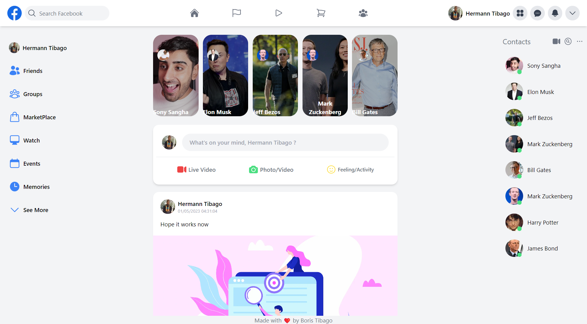
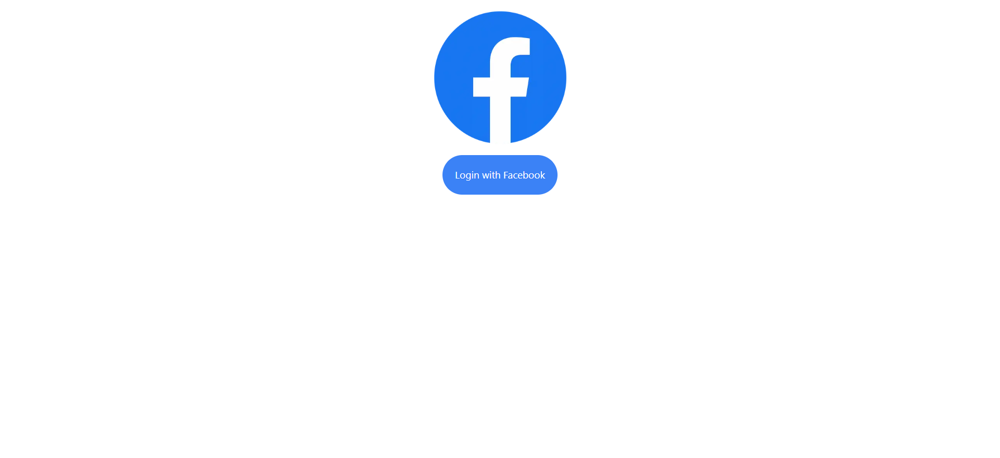

# This is a clone of facebook made with Next JS, Next-Auth with facebook provider, firebase storage and firebase firestore database

## For The Authentication with Next Auth , you need to :
- Create an Facebook app  [here](https://developers.facebook.com/)
- You take the client Id and client secret and put it in your .env.local file
- You add the nextauth url (the localhost url in development) and the next auth secret for the jwt token in your .env.local file as well
- The variables you must have are :
    - FACEBOOK_CLIENT_ID
    - FACEBOOK_CLIENT_SECRET
    - NEXTAUTH_URL
    - NEXTAUTH_SECRET
- In your facebook app you must add a product, the Facebook Login 
- You must add this url : `https://next-auth-example.vercel.app/api/auth/callback/facebook`in your Facebook Login parameter under Valid OAuth redirect URIs
- And you must activate for the `public_profile` the advanced access
- In the Basic parameter of your application you must add a valid URL of Privacy Policy and of Data Deletion. You can deploy your app on vercel before adding authentication and then add the url of your app deployed in these parts.
 
## For the Database and the storage
- Create a project on firebase
- Find the parameter of your project and add it to a file call firebase.js in the root folder of your app
- configure this file
- Add the environment variable to your .env file
- and run the project